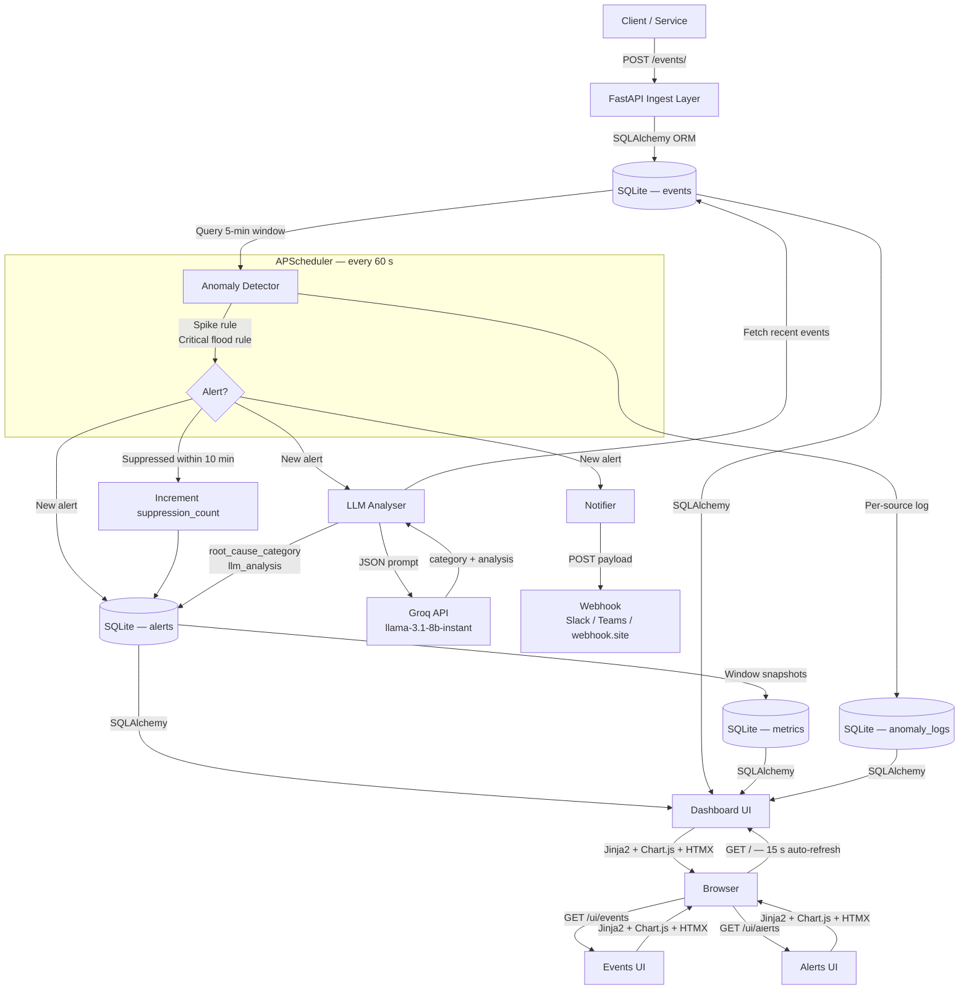

# Observability Watchdog ⚡

An API-first, intelligent observability platform that ingests application events, detects anomalies in real time, enriches every alert with LLM-powered root cause analysis, and surfaces everything in a live auto-refreshing dashboard — all backed by SQLite with zero external infrastructure dependencies.

> **Session stats:** Built in a single Lead Architect session · 45 automated tests · 16 features shipped · 0 manual code edits

---

## Architecture



---

## Feature Overview

| Feature | Detail |
|---|---|
| **Event ingestion** | `POST /events/` — source, level, message, value, tags, timestamp |
| **Anomaly detection** | Spike rule + critical flood rule, configurable thresholds, 60 s cycle |
| **Alert suppression** | 10-min window: no duplicate DB records, no redundant LLM calls; `suppression_count` incremented |
| **LLM root cause analysis** | Groq `llama-3.1-8b-instant`; JSON response `{category, analysis}`; graceful fallback |
| **Root cause categories** | Database · Network · Authentication · Memory/Resource · Application · Unknown |
| **Category badges** | Colour-coded on every alert row; `Unknown` badge shown instead of a dash for uncategorised alerts |
| **Alert suppression badge** | Purple `+N` badge shows how many times an alert was suppressed |
| **Webhook delivery** | POST to any HTTP endpoint on alert fire; tested with webhook.site |
| **Auto-refresh dashboard** | Reloads every 15 s; "Last updated: HH:MM:SS IST" timestamp top-right |
| **IST timestamps** | All times displayed in IST (UTC+5:30) across dashboard, alerts, and events pages |
| **Pie chart % labels** | Doughnut and pie charts show percentage on slices; legend shows `Label (count — X%)` |
| **Aligned RCA legend** | Custom HTML table with Category / Count / Share columns — pixel-perfect alignment |
| **Trends line chart** | Three series (Total / Errors / Warnings) over last 24 h in hourly buckets |
| **Anomaly Detection Log** | Real-time table: Time · Source · Events · Errors · Err% · Threshold · Status |
| **Health endpoint** | `GET /health` — status, version, uptime_seconds, total_events_24h, open_alerts |
| **Log generator script** | `scripts/generate_logs.py` — continuous stream or `--spike` burst |
| **Test suite** | 45 tests across 4 files; in-memory SQLite; no mocks on happy paths |

---

## Tech Stack

| Layer | Technology |
|---|---|
| API framework | [FastAPI](https://fastapi.tiangolo.com/) 0.115 |
| Database | SQLite via [SQLAlchemy](https://www.sqlalchemy.org/) 2.0 (ORM + Core) |
| Schema validation | [Pydantic](https://docs.pydantic.dev/) v2 |
| Background jobs | [APScheduler](https://apscheduler.readthedocs.io/) 3.10 |
| LLM inference | [Groq](https://console.groq.com/) free API — `llama-3.1-8b-instant` |
| Dashboard | [Jinja2](https://jinja.palletsprojects.com/) + [HTMX](https://htmx.org/) + [Chart.js](https://www.chartjs.org/) 4.4 + [chartjs-plugin-datalabels](https://chartjs-plugin-datalabels.netlify.app/) 2.2 |
| ASGI server | [Uvicorn](https://www.uvicorn.org/) |
| Test suite | [pytest](https://pytest.org/) 8.3 — 45 tests, in-memory SQLite with StaticPool |

---

## Setup

### 1. Clone

```bash
git clone https://github.com/neelimanaik/observability-watchdog.git
cd observability-watchdog
```

### 2. Virtual environment

```bash
python -m venv .venv
source .venv/bin/activate      # macOS / Linux
.venv\Scripts\activate         # Windows
```

### 3. Install dependencies

```bash
pip install -r requirements.txt
```

### 4. Configure `.env`

```ini
# Required — free key at https://console.groq.com
GROQ_API_KEY=gsk_your_key_here

# Optional — paste a free URL from https://webhook.site to see live alert payloads
ALERT_WEBHOOK_URL=https://webhook.site/your-unique-id-here
```

> `.env` is git-ignored. Your API key is never committed.

### 5. Run

```bash
uvicorn main:app --host 0.0.0.0 --port 8000 --reload
```

| URL | Purpose |
|---|---|
| http://localhost:8000 | Live dashboard (auto-refreshes every 15 s) |
| http://localhost:8000/ui/events | Filterable event log |
| http://localhost:8000/ui/alerts | Alert list with AI analysis |
| http://localhost:8000/docs | Interactive OpenAPI / Swagger UI |
| http://localhost:8000/health | Health check JSON |

### 6. Seed demo data

```bash
python seed.py          # 300 realistic events across 5 services
```

### 7. Run the test suite

```bash
pytest tests/ -v        # 45 tests, ~35 s
```

---

## Simulating Live Traffic

`scripts/generate_logs.py` streams realistic events to simulate a live environment and trigger anomaly detection.

```bash
# Stream continuous events (mix of info/warn/error/critical) — Ctrl-C to stop
python scripts/generate_logs.py

# Send a spike of 20 consecutive errors to trigger an alert within 60 s
python scripts/generate_logs.py --spike

# Options
#   --host URL       API base URL (default: http://localhost:8000)
#   --interval SECS  Delay between events (default: 0.5 s)
#   --source SVC     Pin to one service name
python scripts/generate_logs.py --spike --source auth-service
```

---

## API Reference

### Events

| Method | Path | Description |
|---|---|---|
| `POST` | `/events/` | Ingest one event |
| `GET` | `/events/` | List events — `?source=`, `?level=`, `?limit=`, `?offset=` |
| `GET` | `/events/{id}` | Single event by ID |

**Payload:**
```json
{
  "source": "payment-service",
  "level": "error",
  "message": "DB connection pool exhausted",
  "value": 503.0,
  "tags": { "env": "prod", "region": "us-east" }
}
```
Valid levels: `info` · `warn` · `error` · `critical`

### Alerts

| Method | Path | Description |
|---|---|---|
| `GET` | `/alerts/` | List alerts — `?acknowledged=true/false` |
| `PATCH` | `/alerts/{id}/acknowledge` | Mark alert acknowledged |

Each alert includes: `rule`, `source`, `message`, `severity`, `acknowledged`, `llm_analysis`, `root_cause_category`, `suppression_count`, `created_at`.

### Metrics

| Method | Path | Description |
|---|---|---|
| `GET` | `/metrics/` | Per-source window snapshots |
| `GET` | `/metrics/root-cause-distribution` | `{category: count}` for all 6 categories |
| `GET` | `/metrics/trends` | Hourly `{total, errors, warnings}` for last 24 h |
| `GET` | `/metrics/anomaly-log` | Last N detection cycle entries |

### System

| Method | Path | Description |
|---|---|---|
| `GET` | `/health` | `{status, version, uptime_seconds, total_events_24h, open_alerts_count}` |

---

## How Anomaly Detection Works

The scheduler runs every 60 seconds and applies two rules over a 5-minute sliding window.

### Spike Rule → `HIGH` alert

```
threshold = max(baseline_avg_per_window × ANOMALY_SPIKE_MULTIPLIER, 10)
if window_count >= threshold  →  fire alert
```

Baseline is the average event count per window over the preceding 30 minutes. Default multiplier: `3.0`.

### Critical Flood Rule → `CRITICAL` alert

```
if critical_events_in_window >= 10  →  fire alert
```

### Alert Suppression (10-minute window)

If an unacknowledged alert for the same **rule + source** was created within the last 10 minutes:
- No new DB record is written
- No LLM call is made
- `suppression_count` on the existing alert is incremented (visible as a purple `+N` badge)

Acknowledging an alert via `PATCH /alerts/{id}/acknowledge` immediately re-arms detection for that source.

### Anomaly Detection Log

Every detection cycle writes one `AnomalyLog` row per active source — recording window count, error count, calculated threshold, and whether an alert fired. Queryable via `GET /metrics/anomaly-log` and visible in the dashboard table.

### Configuration

| Variable | Default | Description |
|---|---|---|
| `ANOMALY_WINDOW_MINUTES` | `5` | Current window size |
| `ANOMALY_SPIKE_MULTIPLIER` | `3.0` | Spike threshold multiplier |
| `SCHEDULER_INTERVAL_SECONDS` | `60` | Cycle frequency |

---

## How LLM Analysis Works

When a new alert fires, `services/llm_analyzer.py` is called **before** the alert is committed to the database.

1. **Context fetch** — 20 most recent events for the affected source in the last 30 minutes
2. **JSON prompt** — System prompt primes Groq as an expert SRE; instructs response as pure JSON:
   ```json
   {"category": "<one of 6>", "analysis": "<2-3 sentence root cause + recommendation>"}
   ```
3. **Groq call** — `llama-3.1-8b-instant`, temperature 0.3, max 512 tokens
4. **Parse** — `_parse_llm_response()` strips markdown fences, validates category (falls back to `Unknown`), handles plain-text fallback
5. **Store** — `alerts.llm_analysis` + `alerts.root_cause_category` committed atomically with the alert
6. **Display** — Category badge always shown (grey `Unknown` if null); analysis in collapsible `▶ View` panel

**Valid categories:** `Database` · `Network` · `Authentication` · `Memory/Resource` · `Application` · `Unknown`

**Graceful degradation:** missing key, quota error, network failure, or malformed JSON — alert is created normally with `NULL` analysis fields. Zero functionality lost.

---

## Webhook Integration

Set `ALERT_WEBHOOK_URL` in `.env` to receive a POST on every new alert.

**Test with webhook.site (free, no sign-up):**
1. Open [https://webhook.site](https://webhook.site) — a unique URL is generated instantly
2. Copy it and paste into `.env`:
   ```ini
   ALERT_WEBHOOK_URL=https://webhook.site/your-unique-id
   ```
3. Run a spike: `python scripts/generate_logs.py --spike`
4. The next detection cycle (≤ 60 s) fires — check your webhook.site inbox

**Payload format** (Slack-compatible):
```json
{
  "text": "*[HIGH]* `spike` on `payment-service`\nEvent spike on 'payment-service': 42 events in last 5m (baseline ~3.2/window)"
}
```

For Teams or custom endpoints, update `services/notifier.py` to adjust the shape.

---

## Dashboard Panels

| Panel | Description |
|---|---|
| **KPI cards** | Total events (24 h) · Errors/Criticals · Open alerts · Active sources |
| **Events by Level** | Doughnut chart — % labels on slices, `Label (count — X%)` legend |
| **Event Volume Over Time** | Hourly line chart — index tooltip shows exact count per hour |
| **Root Cause Distribution** | Pie chart + aligned HTML legend table (Category / Count / Share%) |
| **Trends** | Three-series line chart: Total (blue) / Errors (red) / Warnings (orange) |
| **Recent Alerts** | Severity badge · Category badge · AI analysis panel · Suppression count |
| **Anomaly Detection Log** | Per-source per-cycle: events · errors · error% · threshold · Normal/Anomaly |
| **Recent Events** | Level badge · source · message · value · IST timestamp |

All timestamps displayed in **IST (UTC+5:30)** with `IST` suffix. Dashboard auto-refreshes every **15 seconds**.

---

## Test Suite

```
tests/
├── conftest.py          — in-memory SQLite with StaticPool; db_session + client fixtures
├── test_anomaly.py      — 9 tests: spike detection, critical flood, metric snapshots
├── test_events_api.py   — 15 tests: POST /events/ validation, GET filtering, pagination
├── test_llm_analyser.py — 14 tests: JSON parsing, category validation, all fallbacks
└── test_suppression.py  — 7 tests: window logic, count increment, LLM call gating
```

```bash
pytest tests/ -v
# 45 passed, 1 warning in ~35s
```

---

## Project Structure

```
observability-watchdog/
├── main.py                  # FastAPI app, /health, UI routes, to_ist Jinja2 filter
├── config.py                # Pydantic settings — reads .env
├── database.py              # SQLAlchemy engine, session factory, init_db
├── scheduler.py             # APScheduler 60-second detection loop
├── seed.py                  # Demo event generator (300 events)
├── models/
│   ├── event.py             # Event ORM model
│   ├── alert.py             # Alert — includes llm_analysis, root_cause_category, suppression_count
│   ├── metric.py            # Per-window metric snapshot
│   └── anomaly_log.py       # Per-source per-cycle detection log
├── routers/
│   ├── events.py            # POST + GET /events/
│   ├── alerts.py            # GET + PATCH /alerts/
│   └── metrics.py           # /metrics/, /trends, /anomaly-log, /root-cause-distribution
├── services/
│   ├── ingestion.py         # Event validation and DB write
│   ├── anomaly.py           # Spike + flood + suppression + anomaly logging
│   ├── llm_analyzer.py      # JSON-mode Groq prompt, (analysis, category) return
│   └── notifier.py          # Webhook POST dispatch
├── scripts/
│   └── generate_logs.py     # Continuous event streamer — --spike, --host, --interval
├── templates/
│   ├── base.html            # Dark theme, severity/category badge CSS, CDN scripts
│   ├── dashboard.html       # Auto-refresh, 4 charts, anomaly log table, IST timestamps
│   ├── events.html          # Filterable event log with IST timestamps
│   └── alerts.html          # Full alert list with AI analysis and category badges
├── tests/
│   ├── conftest.py
│   ├── test_anomaly.py
│   ├── test_events_api.py
│   ├── test_llm_analyser.py
│   └── test_suppression.py
├── .env                     # Local secrets — git-ignored
├── .gitignore
└── requirements.txt
```

---

## License

MIT
