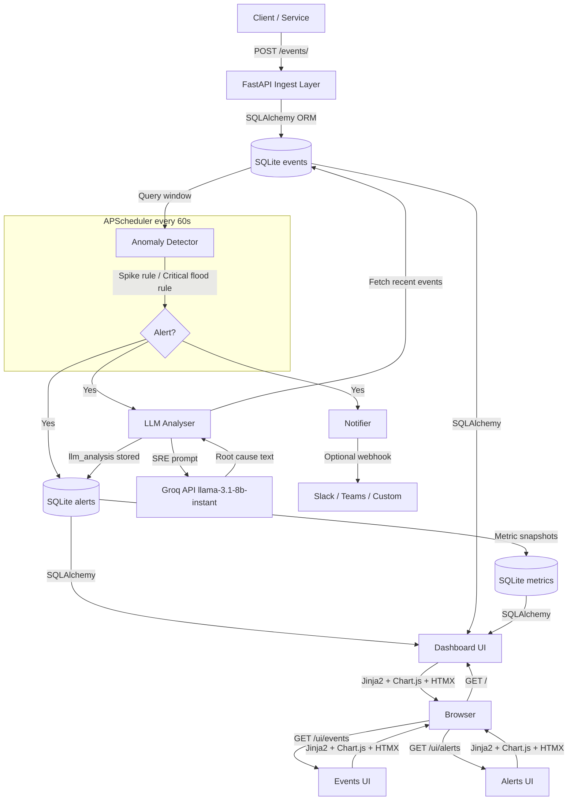

# Observability Watchdog

An API-first, intelligent observability platform that ingests application events, detects anomalies in real time, and uses a large language model to generate human-readable root cause analysis — all backed by SQLite and served through a live dashboard.

Built as a full-stack Python project demonstrating event-driven architecture, automated anomaly detection with configurable thresholds, and LLM-powered SRE workflows using the Groq free API tier.

---

## Architecture



---

## Tech Stack

| Layer | Technology |
|---|---|
| API framework | [FastAPI](https://fastapi.tiangolo.com/) 0.115 |
| Database | SQLite via [SQLAlchemy](https://www.sqlalchemy.org/) 2.0 |
| Schema validation | [Pydantic](https://docs.pydantic.dev/) v2 |
| Background jobs | [APScheduler](https://apscheduler.readthedocs.io/) 3.10 |
| LLM inference | [Groq](https://console.groq.com/) free API — `llama-3.1-8b-instant` |
| Dashboard | [Jinja2](https://jinja.palletsprojects.com/) + [HTMX](https://htmx.org/) + [Chart.js](https://www.chartjs.org/) |
| ASGI server | [Uvicorn](https://www.uvicorn.org/) |
| Test suite | [pytest](https://pytest.org/) — 34 tests, in-memory SQLite |

---

## Setup

### 1. Clone the repository

```bash
git clone https://github.com/neelimanaik/observability-watchdog.git
cd observability-watchdog
```

### 2. Create and activate a virtual environment

```bash
python -m venv .venv
# macOS / Linux
source .venv/bin/activate
# Windows
.venv\Scripts\activate
```

### 3. Install dependencies

```bash
pip install -r requirements.txt
```

### 4. Configure environment variables

Edit `.env` and set your Groq API key (free at [console.groq.com](https://console.groq.com)):

```ini
GROQ_API_KEY=[REDACTED]_key_here
ALERT_WEBHOOK_URL=          # optional — Slack/Teams incoming webhook
```

> **Note:** `.env` is git-ignored. Your API key is never committed.

### 5. Run the server

```bash
uvicorn main:app --host 0.0.0.0 --port 8000 --reload
```

Open **http://localhost:8000** for the dashboard or **http://localhost:8000/docs** for the interactive API explorer.

### 6. Seed demo data (optional)

```bash
python seed.py
```

Injects 300 realistic events across 5 simulated services spread over the last 24 hours.

### 7. Run the test suite

```bash
pytest tests/ -v
```

---

## API Endpoints

### Events

| Method | Path | Description |
|---|---|---|
| `POST` | `/events/` | Ingest a new event |
| `GET` | `/events/` | List events — filter by `source`, `level`; paginate with `limit` / `offset` |
| `GET` | `/events/{id}` | Fetch a single event by ID |

**Example payload:**

```json
{
  "source": "payment-service",
  "level": "error",
  "message": "DB connection pool exhausted",
  "value": 503.0,
  "tags": { "env": "prod", "region": "us-east" }
}
```

Valid levels: `info` · `warn` · `error` · `critical`

### Alerts

| Method | Path | Description |
|---|---|---|
| `GET` | `/alerts/` | List alerts — filter by `acknowledged` |
| `PATCH` | `/alerts/{id}/acknowledge` | Mark an alert as acknowledged |

### Metrics

| Method | Path | Description |
|---|---|---|
| `GET` | `/metrics/` | List per-source window snapshots — filter by `source` |

### Dashboard UI

| Path | Description |
|---|---|
| `GET /` | KPI stats, charts, recent alerts with AI analysis, recent events |
| `GET /ui/events` | Filterable event log |
| `GET /ui/alerts` | Full alert list with collapsible AI analysis panels |
| `GET /docs` | Interactive OpenAPI / Swagger UI |

---

## How Anomaly Detection Works

APScheduler runs a detection cycle every 60 seconds (configurable via `SCHEDULER_INTERVAL_SECONDS`). Each cycle applies two rules against a sliding time window (default: last 5 minutes).

### Rule 1 — Event Spike

Compares the current window event count per source against a 6-window baseline (the preceding 30 minutes):

```
threshold = max(baseline_avg_per_window x ANOMALY_SPIKE_MULTIPLIER, 10)
if current_count >= threshold  ->  fire HIGH alert
```

Default multiplier is `3.0` — a source must emit 3x its recent average (minimum 10 events) to trigger.

### Rule 2 — Critical Flood

```
if critical_count_in_window >= 10  ->  fire CRITICAL alert
```

### Deduplication

An alert is only created if no unacknowledged alert for the same rule + source already exists. Acknowledging via `PATCH /alerts/{id}/acknowledge` re-arms the detector.

### Metric Snapshots

After each cycle, a `Metric` row is written per active source capturing event count and average numeric value — queryable via `GET /metrics/`.

### Configuration

| Variable | Default | Description |
|---|---|---|
| `ANOMALY_WINDOW_MINUTES` | `5` | Detection window size |
| `ANOMALY_SPIKE_MULTIPLIER` | `3.0` | Spike threshold multiplier |
| `SCHEDULER_INTERVAL_SECONDS` | `60` | Cycle frequency |

---

## How LLM Analysis Works

When the detector fires a new alert, `services/llm_analyzer.py` is called immediately, before the alert is written to the database.

**Steps:**

1. **Fetch context** — Retrieves the 20 most recent events for the affected source from the last 30 minutes.

2. **Build SRE prompt** — Formats the alert description and event log into a structured message. The system prompt primes the model as an expert SRE instructed to give a 2-3 sentence root cause analysis and one actionable recommendation.

3. **Call Groq** — Sends to `llama-3.1-8b-instant` (temperature 0.3, max 512 tokens).

4. **Store** — The analysis string is saved to `alerts.llm_analysis`.

5. **Display** — The dashboard renders a collapsible "View analysis" panel per alert row.

**Graceful degradation:** If `GROQ_API_KEY` is absent, a placeholder, or the API call fails for any reason, `llm_analysis` is stored as `NULL` and the UI shows a dash. All other functionality continues normally — LLM analysis is additive, never a hard dependency.

---

## Project Structure

```
observability-watchdog/
├── main.py                  # FastAPI app + UI routes
├── config.py                # Pydantic settings (reads .env)
├── database.py              # SQLAlchemy engine + session factory
├── scheduler.py             # APScheduler background job
├── seed.py                  # Demo data generator
├── models/
│   ├── event.py
│   ├── alert.py             # includes llm_analysis field
│   └── metric.py
├── routers/
│   ├── events.py
│   ├── alerts.py
│   └── metrics.py
├── services/
│   ├── ingestion.py         # Event validation + DB write
│   ├── anomaly.py           # Spike + flood detection engine
│   ├── llm_analyzer.py      # Groq prompt builder + API call
│   └── notifier.py          # Webhook dispatch
├── templates/
│   ├── base.html            # Dark-theme nav + CSS
│   ├── dashboard.html       # KPI cards, charts, tables
│   ├── events.html
│   └── alerts.html
├── tests/
│   ├── conftest.py          # In-memory SQLite fixtures (StaticPool)
│   ├── test_anomaly.py      # 9 unit tests
│   ├── test_events_api.py   # 15 integration tests
│   └── test_llm_analyser.py # 10 tests — fallback + mocked API
├── .env                     # Local secrets — git-ignored
├── .gitignore
└── requirements.txt
```

---

## License

MIT
